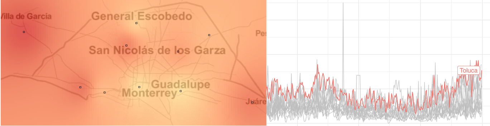

<!-- README.md is generated from README.Rmd. Please edit that file -->

```{r, echo = FALSE}
knitr::opts_chunk$set(
  collapse = TRUE,
  comment = "#>",
  fig.path = "man/figures/README-",
  out.width = '100%'
)
```

# rsinaica

[](https://github.com/diegovalle/rsinaica/actions/workflows/R-CMD-check.yaml)
[](https://app.codecov.io/github/diegovalle/rsinaica?branch=master)
[](https://lifecycle.r-lib.org/articles/stages.html)    
[](https://cran.r-project.org/package=rsinaica)

```{r echo=FALSE, out.width='100%'}

```

Easy-to-use functions for downloading air quality data from the Mexican National Air Quality Information System (SINAICA). This R package allows you to download pollution and meteorological data from more than one hundred monitoring stations across Mexico. You can query crude real-time data, validated data, or manually collected data.

## Installation

To install the most recent package version from [CRAN](https://cran.r-project.org/package=rsinaica), run:

```r
install.packages("rsinaica")
```

You can always install the development version from GitHub:

```r
if (!require(devtools)) {
    install.packages("devtools")
}
devtools::install_github("diegovalle/rsinaica")
```

## Example

Suppose you want to download pollution data from the _Centro_ station in
Guadalajara. First, load the required packages and look up the station’s 
numeric code in the `stations_sinaica` data.frame:

```{r example, warning=FALSE,message=FALSE}
## Auto-install required R packages
packs <- c("ggplot2", "maps", "mapproj", "rsinaica")
success <- suppressWarnings(sapply(packs, require, character.only = TRUE))
if (length(names(success)[!success])) {
  install.packages(names(success)[!success])
  sapply(names(success)[!success], require, character.only = TRUE)
}

knitr::kable(stations_sinaica[which(stations_sinaica$station_name == "Centro"), 1:6])
```

There are three stations named Centro. The one we want is located in Guadalajara and has a numeric code (station_id) of 102. The ```stations_sinaica``` data.frame also includes the latitude and longitude of all monitoring stations in Mexico (including some that have never reported data)..

```{r warning=FALSE}
mx <- map_data("world", "Mexico")
stations_sinaica$color <- "Others"
stations_sinaica$color[stations_sinaica$station_id == 102] <- "Centro (102)"
## There seems to be a mistake in some of the air quality stations longitudes
## having been assigned positive values (longitudes to the west of the
## prime meridian are supposed to be negative)
stations_sinaica <- subset(stations_sinaica, lon < 0)
ggplot(stations_sinaica[order(stations_sinaica$color, decreasing = TRUE),], aes(lon, lat)) + 
  geom_polygon(data = mx, aes(x= long, y = lat, group = group)) +
  geom_point(alpha = .9, size = 3, aes(fill = color), shape = 21) + 
  scale_fill_discrete("station") +
  ggtitle("Air quality measuring stations in Mexico") +
  coord_map() + 
  theme_void()
```

Next, query the start and end dates for which SINAICA has received data from this station:

```{r}
sinaica_station_dates(102)
```

The station is currently reporting data (this document was built on `r Sys.Date()`), and it has been active since 1997. You can also query which parameters (pollution, wind, solar radiation, etc.) the station measures. the station has sensors for. The package also includes a ```parameters``` data.frame containing the complete set of supported parameters; however, not all stations report all of them.

```{r}
cen_params <- sinaica_station_params(102)
knitr::kable(cen_params)
```

Finally, download and plot hourly concentrations of particulate matter with a diameter smaller than 10 micrometers (μm) (PM<sub>10</sub>), for the month of January.

```{r}
# Download all PM10 data for January 2018
df <-  sinaica_station_data(102, # station_id
                         "PM10", # parameter
                         "2018-01-01", # start_date
                         "2018-01-31", # end_date
                         "Crude" # Crude, Manual or Validated
                         )

ggplot(df, aes(hour, value, group = date)) +
  geom_line(alpha=.9) +
  ggtitle(expression(paste(PM[10],
                           " pollution during January 2018 at the",
                           " Centro station in Guadalajara"))) +
  labs(subtitle="Each line corresponds to a day") +
  xlab("hour") +
  ylab(expression(paste(mu,"g/", m^3))) +
  theme_bw()
```


The hours are shown in the local Guadalajara time zone (UTC−6), since we plotted January 2018 data.

```{r}
stations_sinaica$timezone[which(stations_sinaica$station_id == 102)]
```

You can find a handy map of Mexico's time zones from [Wikipedia](https://en.wikipedia.org/wiki/Time_in_Mexico) to help you with any time conversions you might need.
