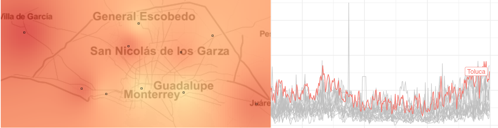

<!-- README.md is generated from README.Rmd. Please edit that file -->

```{r, echo = FALSE}
knitr::opts_chunk$set(
  collapse = TRUE,
  comment = "#>",
  fig.path = "man/figures/README-",
  out.width = '100%'
)
```

# rsinaica

[](https://travis-ci.org/diegovalle/rsinaica) 
[](https://ci.appveyor.com/project/diegovalle/rsinaica/branch/master) 
[](https://codecov.io/github/diegovalle/rsinaica?branch=master)
[](https://www.tidyverse.org/lifecycle/#maturing) 
[](https://cran.r-project.org/package=rsinaica)

```{r echo=FALSE, out.width='100%'}

```

Easy-to-use functions for downloading air quality data from the Mexican National 
Air Quality Information System (SINAICA). With this R package you can download pollution 
and meteorological parametrs from the more than a hundred monitoring stations located throughout Mexico. The package allows you to query for crude real-time air quality data, validated data, or manually collected data.

## Installation

To install the most recent package version from [CRAN](https://cran.r-project.org/package=rsinaica) type:

```r
install.packages("rsinaica")
```

You can always install the development version from GitHub:

```r
if (!require(devtools)) {
    install.packages("devtools")
}
devtools::install_github("diegovalle/rsinaica")
```

## Example

Suppose you wanted to download pollution data from the _Centro_ station in
Guadalajara. First, we load the necessary packages and look up the numeric code
for the station in the `stations_sinaica` data.frame:

```{r example, warning=FALSE,message=FALSE}
## Auto-install required R packages
packs <- c("ggplot2", "maps", "mapproj", "rsinaica")
success <- suppressWarnings(sapply(packs, require, character.only = TRUE))
if (length(names(success)[!success])) {
  install.packages(names(success)[!success])
  sapply(names(success)[!success], require, character.only = TRUE)
}

knitr::kable(stations_sinaica[which(stations_sinaica$station_name == "Centro"), 1:6])
```

It looks like there are three stations named Centro, the one we are looking for is the one in Guadalajara with a numeric code (station_id) of 102. The ```stations_sinaica``` data.frame also includes the latitude and longitude of all the measuring stations in Mexico (including some that have never reported any data!).

```{r warning=FALSE}
mx <- map_data("world", "Mexico")
stations_sinaica$color <- "Others"
stations_sinaica$color[stations_sinaica$station_id == 102] <- "Centro (102)"
ggplot(stations_sinaica[order(stations_sinaica$color, decreasing = TRUE),], aes(lon, lat)) + 
  geom_polygon(data = mx, aes(x= long, y = lat, group = group)) +
  geom_point(alpha = .9, size = 3, aes(fill = color), shape = 21) + 
  scale_fill_discrete("station") +
  ggtitle("Air quality measuring stations in Mexico") +
  coord_map() + 
  theme_void()
```

Then we query the start and end dates for which SINAICA has received data from the station:

```{r}
sinaica_station_dates(102)
```

It's currently reporting data (this document was built on `r Sys.Date()`), and has been doing so since 1997. We can also query which type of parameters (pollution, wind, solar radiation, etc) the station has sensors for. Note that the package also includes a ```parameters```
data.frame with the complete set of supported parameters, but not all stations support all of them.

```{r}
cen_params <- sinaica_station_params(102)
knitr::kable(cen_params)
```

Finally, we can download and plot hourly concentrations of particulate matter with a diameter smaller than 10 micrometers (μm) (PM<sub>10</sub>) during the month of January.

```{r}
# Download all PM10 data for January 2018
df <-  sinaica_station_data(102, # station_id
                         "PM10", # can be one of parameters$parameter_code
                         "2018-01-01", 
                         "2018-01-31", # Maximum of one month
                         "Crude" # Crude, Manual or Validated
                         )

ggplot(df, aes(hour, value, group = date)) +
  geom_line(alpha=.9) +
  ggtitle(expression(paste(PM[10],
                           " pollution during January 2018 in Centro, Guadalajara, by hour"))) +
  xlab("hour") +
  ylab(expression(paste(mu,"g/", m^3))) +
  theme_bw()
```


the hours are in the local Guadalajara time zone of UTC-6 since we plotted January data.

```{r}
stations_sinaica$timezone[which(stations_sinaica$station_id == 102)]
```

You can find a handy map of Mexico's time zones from [Wikipedia](https://en.wikipedia.org/wiki/Time_in_Mexico) to help you with any time conversions you might need.
