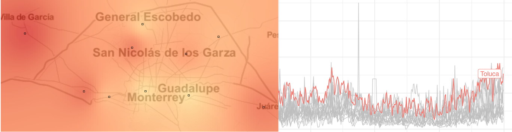
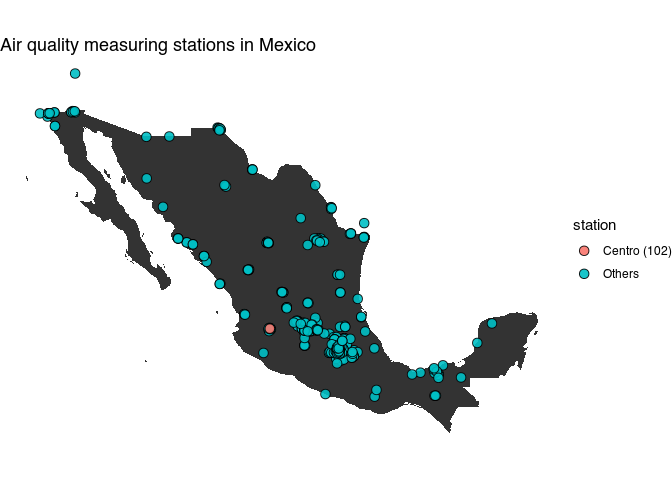
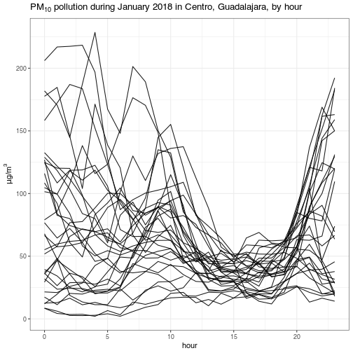

<!-- README.md is generated from README.Rmd. Please edit that file -->
rsinaica
========

[](https://travis-ci.org/diegovalle/rsinaica) [](https://ci.appveyor.com/project/diegovalle/rsinaica/branch/master) [](https://codecov.io/github/diegovalle/rsinaica?branch=master) [](https://www.tidyverse.org/lifecycle/#experitmental) []()



Ready-made functions for downloading air quality data from the Mexican National Air Quality Information System (SINAICA). With this R package you can download pollution and meteorological parametrs from the more than a 150 monitoring stations reporting to SINAICA. The package allows you to query for the 'crude' real-time air quality data, or older validated or manually collected data.

Installation
------------

rsinaica is not currently available from CRAN, but you can install the development version from github with:

``` r
if (!require(devtools)) {
    install.packages("devtools")
}
devtools::install_github('diegovalle/rsinaica')
```

<!--ou can install the released version of rsinaica from [CRAN](https://CRAN.R-project.org) with:

``` r
install.packages("rsinaica")
```-->
Example
-------

Suppose you wanted to download pollution data from the *Centro* station in Guadalajara. First, we load the necessary packages and look up the numeric code for the station in the `stations_sinaica` data.frame:

``` r
## Auto-install required R packages
packs <- c("ggplot2", "maps", "mapproj")
success <- suppressWarnings(sapply(packs, require, character.only = TRUE))
if (length(names(success)[!success])) {
  install.packages(names(success)[!success])
  sapply(names(success)[!success], require, character.only = TRUE)
}
library("rsinaica")

knitr::kable(stations_sinaica[which(stations_sinaica$station_name == "Centro"), 1:6])
```

|     |  station\_id| station\_name | station\_code |  network\_id| network\_name  | network\_code |
|-----|------------:|:--------------|:--------------|------------:|:---------------|:--------------|
| 12  |           33| Centro        | CEN           |           30| Aguascalientes | AGS           |
| 42  |           54| Centro        | CEN           |           38| CHIH1          | CHIH1         |
| 75  |          102| Centro        | CEN           |           63| Guadalajara    | GDL           |

It looks like there are three stations named Centro, the one we are looking for is the one in Guadalajara with a numeric code of 102 (station\_id). The `stations_sinaica` data.frame also includes the latitude and longitude of all the measuring stations in Mexico (including some that have never reported any data!).

``` r
mx <- map_data("world", "Mexico")
stations_sinaica$color <- "Others"
stations_sinaica$color[stations_sinaica$station_id == 102] <- "Centro (102)"
ggplot(stations_sinaica[order(stations_sinaica$color, decreasing = TRUE),], aes(lon, lat)) + 
  geom_polygon(data = mx, aes(x= long, y = lat, group = group)) +
  geom_point(alpha = .9, size = 3, aes(fill = color), shape = 21) + 
  scale_fill_discrete("station") +
  ggtitle("Air quality measuring stations in Mexico") +
  coord_map() + 
  theme_void()
```



Then we query the dates during which the station has been in operation:

``` r
get_station_dates(102)
#> [1] "1997-01-01" "2018-04-11"
```

It's currently reporting data, and has been doing so since 1997. We can also query which type of parameters (pollution, wind, solar radiation, etc) the station has sensors for. Note that the package also includes a `parameters` data.frame with the complete set of supported parameters, but not all stations support all of them.

``` r
cen_params <- get_station_parameters(102)
knitr::kable(cen_params)
```

| parameter\_code | parameter\_name                 |
|:----------------|:--------------------------------|
| CN              | Carbono negro                   |
| SO2             | Dióxido de azufre               |
| NO2             | Dióxido de nitrógeno            |
| DV              | Dirección del viento            |
| HR              | Humedad relativa                |
| CO              | Monóxido de carbono             |
| NO              | Óxido nítrico                   |
| NOx             | Óxidos de nitrógeno             |
| O3              | Ozono                           |
| PM10            | Partículas menores a 10 micras  |
| PM2.5           | Partículas menores a 2.5 micras |
| PP              | Precipitación pluvial           |
| TMPI            | Temperatura interior            |
| VV              | Velocidad del viento            |

Finally, we can download and plot particulate matter with a diameter smaller than 10 micrometers (μm) (PM<sub>10</sub>) for the month of January

``` r
# Download all PM10 data for January 2018
df <-  sinaica_bystation(102, "PM10", "2018-01-01", "2018-01-31", "Crude")

ggplot(df, aes(hour, value, group = date)) +
  geom_line(alpha=.9) +
  ggtitle(expression(paste(PM[10],
                           " pollution during January 2018 in Centro, Guadalajara, by hour"))) +
  xlab("hour") +
  ylab(expression(paste(mu,"g/", m^3))) +
  theme_bw()
```


